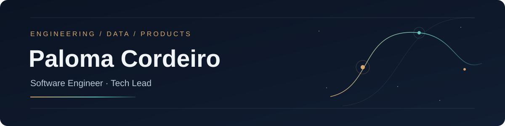

# Hi, I'm Paloma Cordeiro 👋

**Software Engineer & Tech Lead** — backend, data, and full-stack product development.

I care about the decisions behind a system: who owns the data, what happens when something fails, how a result can be reproduced, and whether the product is actually useful to the person on the other side of the screen.

📍 Based in Brazil · 🛠️ Python, TypeScript, PostgreSQL — and a lot of curiosity

---

## 🔓 Open source & live products

| Project | What it shows |
|---|---|
| **[OpenWEC](https://github.com/palomacdev/openwec)** ([live](https://openwec.com)) | Endurance racing data across five series — collection pipelines, PostgreSQL, a FastAPI API, a Python SDK, and a React dashboard. Public repo and live product, end to end. |
| **[PLOT / Heavenverso](https://heavenverso.com.br)** | A live author website built as its own digital world. PLOT is my studio for author sites — product thinking, editorial design, and frontend engineering combined. |
| **[ml-lab](https://github.com/palomacdev/ml-lab)** | A reproducible Kafka + Spark + MLflow environment for streaming data and fraud detection experiments — limits and next steps documented in the repo. |

## 🔒 Products & research in progress
*(private repositories — descriptions reflect the work, not public availability)*

| Project | Focus |
|---|---|
| **Alphecca** | Multi-tenant quotation SaaS — org-scoped data access, role-based permissions, backend-owned monetary calculations, versioned proposals. |
| **Talos** | Application monitoring via HTTP, SSL, and heartbeat checks — observations feed monitor state, incident lifecycles, and alerts, with tenant isolation. |
| **Argos** | A CRM built around the commercial loop: opportunity → activity → next action → outcome, without unnecessary ceremony. |
| **Asterism** | A local-first personal knowledge graph — portable Markdown sources, provenance tracking, graph relationships, and assisted extraction. |
| **F1 Analytics** | Private research into qualifying prediction and race analysis, with a focus on reproducible evaluation before trusting any forecast. |

---

## How I engineer

- **Make boundaries explicit** — in Alphecca and Argos, organization ownership lives in the data model and API behavior, not a filter bolted on at the end.
- **Keep evidence close to decisions** — OpenWEC exposes reusable race data; Talos stores raw observations before deciding what an incident means.
- **Ship the whole experience** — schema, API, interface, tests, deployment, docs. PLOT and OpenWEC are different flavors of the same habit.

**Tools:** Python · Django · FastAPI · React · TypeScript · Astro · PostgreSQL · Redis · Kafka · Spark · Docker · pytest · Playwright

---

📫 [LinkedIn](https://www.linkedin.com/in/paloma-cordeiro-119750b6) · [Email](mailto:palomacordeiro2009@hotmail.com) · [OpenWEC](https://openwec.com)

